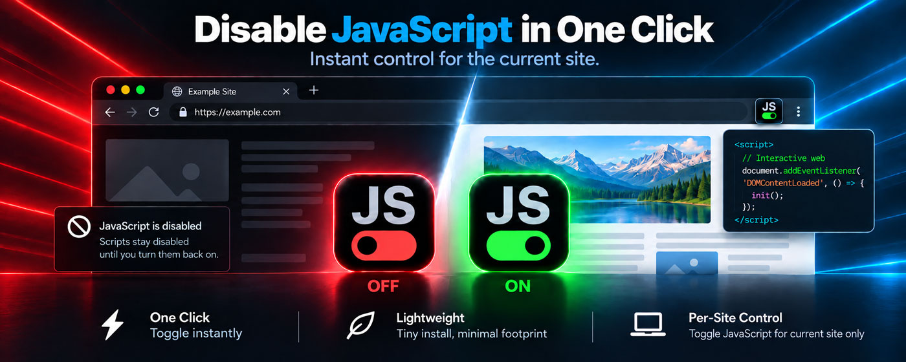

[](https://github.com/dmhendricks/disable-javascript/releases)
[](https://github.com/dmhendricks/disable-javascript/actions)
[](https://chromewebstore.google.com/detail/disable-javascript/alfbcodfodimbdbcdeiidkdllbfppapc)
[](https://github.com/dmhendricks/disable-javascript/blob/main/LICENSE)

# Disable JavaScript



Toggle JavaScript (enable/disable) for the **current site** from the toolbar. The setting applies to that origin (scheme + host + port), not to every tab in the browser.

## Installation

The easiest way to install this extension is from the [Chrome Web Store](https://chromewebstore.google.com/detail/disable-javascript/alfbcodfodimbdbcdeiidkdllbfppapc).

## Usage

- Click the toolbar icon to toggle JavaScript for the current site. The tab reloads so the change takes effect.
- Press `Alt+Shift+J` (`Option+Shift+J` on macOS) to do the same thing from the keyboard. Rebind it at `chrome://extensions/shortcuts` (Google Chrome) or `edge://extensions/shortcuts` (Microsoft Edge).
- Right-click the toolbar icon and choose **Options** to open the options page.
- Blocked sites stay blocked until you toggle them again or clear them from the options page.

## Development

Requires Node 20+.

```bash
npm install
npm dev
```

Then load unpacked from `dist/`:

2. Open `chrome://extensions` (Google Chrome) or `edge://extensions` (Microsoft Edge).
3. Turn on **Developer mode**.
4. Click **Load unpacked** and choose the `dist/` directory.

